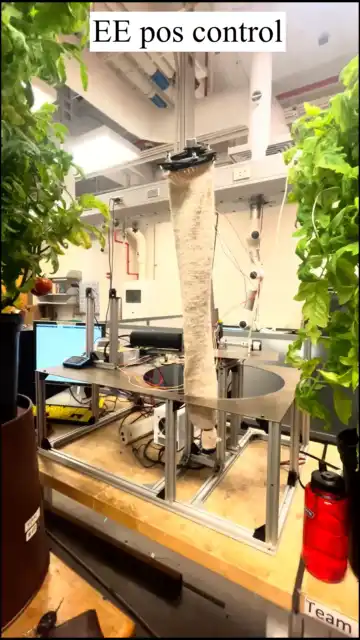
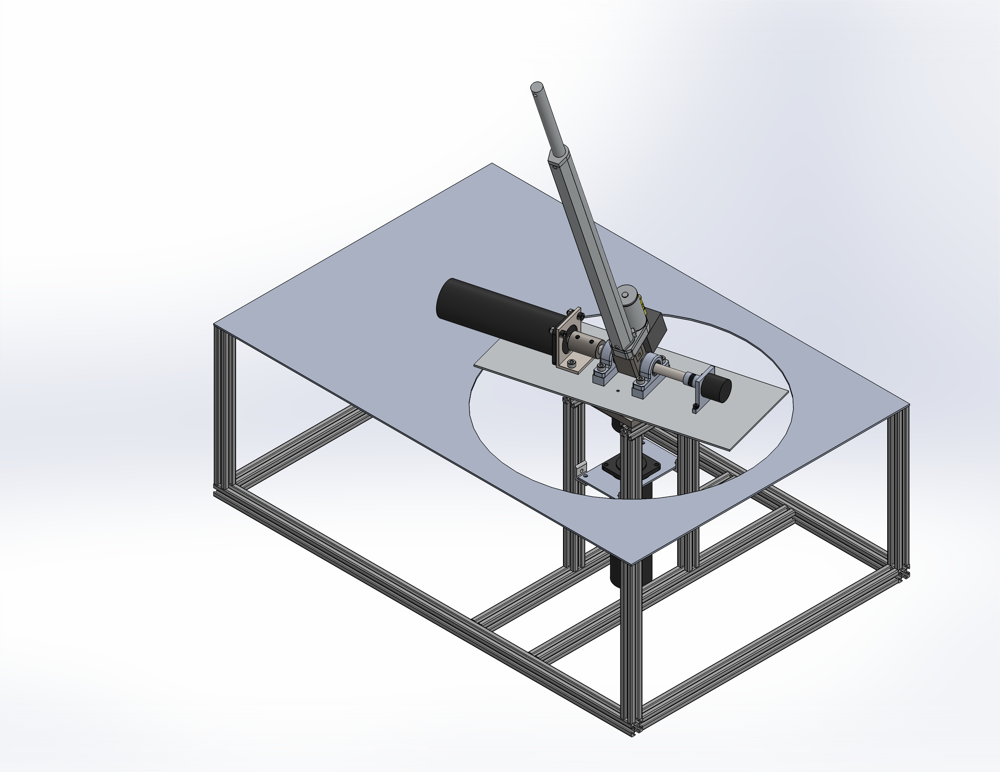

# Tomato-Harvester
*4-DOF Autonomous tomato harvester robotic manipulator featuring a MIMO LQG control system and computer vision, implemented in MATLAB/Simulink.*

## Project Overview
In this project, I developed the mechanical design, electromechanical model, and control architecture for an autonomous tomato harvester robotic arm. Using voltage control across two DC motors and a DC linear actuator, I was able to precisely position the end-effector using a Linear Quadratic Regulator (LQR) controller. Of the 9 total states, the 3 positions ($\phi, \theta, r$) were the only ones measured so a Kalman Filter was used to estimate the remaining states.

## Key Features
* **Precise Control:** Achieved end-effector position error magnitude under 3mm at max extension.
* **Optimal State Estimation:** Implemented a Kalman Filter to estimate unmeasured states (motor currents and velocities) from the three measured states.
* **System Identification:** Applied grey-box system identification to accurately obtain unkown model parameters using experimental data.
* **Custom Fabrication:** Designed many hardware elements using Design for Manufacturing (DFM) principles and machined components on a vertical mill.

## Visuals
### 1. Control System Demonstration
Closed-loop system moving to a pseudo tomato location, closing gripper, retracting, opening gripper, and returning to the origin.

  

### 2. Simulink Control Architecture
The control system is built in Simulink/Simulink Desktop Real-Time and operates as a state machine. It captures images on both cameras, identifies tomatoes and triangulates positions, updates setpoint and moves to tomato location, closes gripper, retracts, opens gripper, returns to origin, and repeats.

  
  

### 3. Mechanical Design
The mechanical design was chosen to resemble spherical coordinates using two brushed DC motors and a screw linear actuator.

  
  

## 4. Electromechanical Dynamics Model

## Skills Used
**Software:** MATLAB
**Concepts:** 
