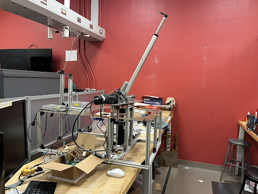
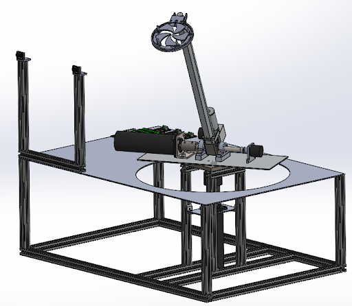
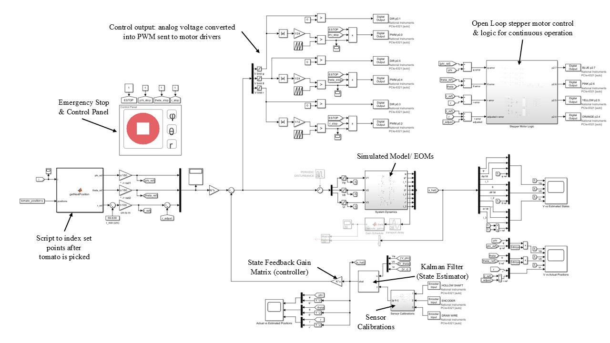
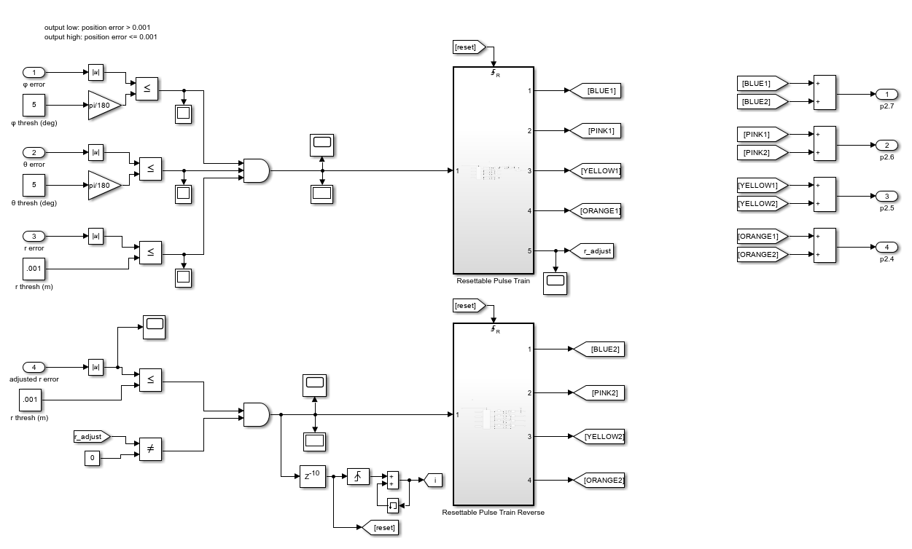
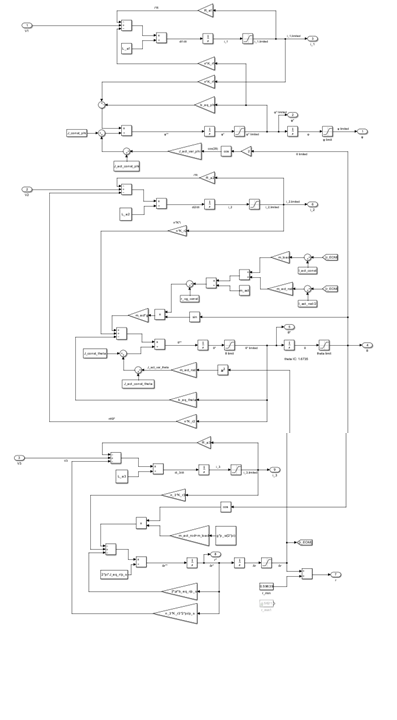

# Tomato-Harvester
*Autonomous tomato harvester mechanical arm implemented in MATLAB/Simulink.*

## Project Overview
In this project, I developed a Linear Quadratic Gaussian (LQR controller + Kalman Filter state estimator) control system for a spherical-coordinates inspired robotic arm. I used voltage control to precisely position the end effector using 3 DC motors by utilizing the dynamics model of the motors and mechanical system. Of the 9 total states, the 3 positions ($\phi, \theta, r$) were the only ones measured so a Kalman Filter was used to estimate the remaining states (motor currents, velocities). 

## Key Features
* Estimated impulsive maneuvers and drag.
* Accounted for $J2/J3$ and lunar third-body effects.
* Handled simulated range and range-rate measurements.

## Visuals
Mechanical Design

  
  

Control System

  
  

Electromechanical Dynamics Model

## Skills Used
**Software:** MATLAB
**Concepts:** State Estimation, Trajectory Optimization
